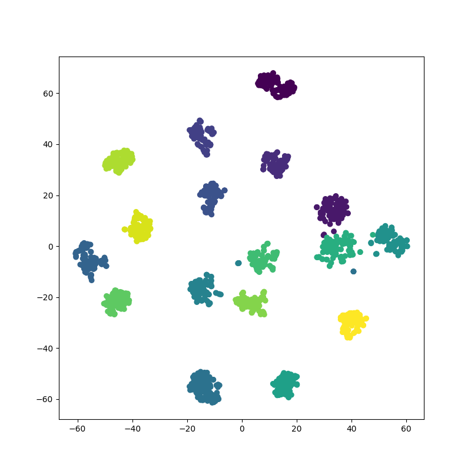

Triplet loss for facial recognition.

# Triplet Face

The repository contains code for the application of triplet loss training to the
task of facial recognition. This code has been produced for a lecture and is not
going to be maintained in any sort.

## Différentes étapes du Project

### 1 - Import du projet de Github sur Colab
```bash
!git clone https://github.com/DaniCpn/TripletFace.git
```
### 2 - Ajout des différents import nécessaires au projet (en vérifiant l'utilisation du GPU)
```bash
from __future__ import print_function, division

import torch
import torch.nn as nn
import torch.optim as optim
from torch.optim import lr_scheduler
from torch.autograd import Variable
import numpy as np
import torchvision
from torchvision import datasets, models, transforms
import matplotlib.pyplot as plt
import time
import os
import copy
import csv

plt.ion()  

use_gpu = torch.cuda.is_available()
if use_gpu:
    print("Using CUDA")
```

### 3 -  Installation de TripletTorch
```bash
!pip3 install triplettorch
from triplettorch import HardNegativeTripletMiner
from triplettorch import AllTripletMiner
```

### 4 -  Le dataset est sauvegardé sur le drive -> récupération de drive
```bash
from google.colab import drive
drive.mount('/content/drive')
```

### 5 - Dézippage du dataset
```bash
!unzip "/content/drive/My Drive/DatasetIA.zip"
```

### 6 - Vérification que tout est en ordre
```bash
%cd ../content/TripletFace/
!ls
```

### 7 - TRAIN
```bash
!python -m tripletface.train -s ../dataset/ -m mode
```

### 8 - Resultat



## Architecture

The proposed architecture is pretty simple and does not implement state of the
art performances. The chosen architecture is a fine tuning example of the
resnet18 CNN model. The model includes the freezed CNN part of resnet, and its
FC part has been replaced to be trained to output latent variables for the
facial image input.

The dataset needs to be formatted in the following form:
```
dataset/
| test/
| | 0/
| | | 00563.png
| | | 01567.png
| | | ...
| | 1/
| | | 00011.png
| | | 00153.png
| | | ...
| | ...
| train/
| | 0/
| | | 00001.png
| | | 00002.png
| | | ...
| | 1/
| | | 00001.png
| | | 00002.png
| | | ...
| | ...
| labels.csv        # id;label
```

## Install

Install all dependencies ( pip command may need sudo ):
```bash
cd TripletFace/
pip3 install -r requirements.txt
```

## Usage

For training:
```bash
usage: train.py [-h] -s DATASET_PATH -m MODEL_PATH [-i INPUT_SIZE]
                [-z LATENT_SIZE] [-b BATCH_SIZE] [-e EPOCHS]
                [-l LEARNING_RATE] [-w N_WORKERS] [-r N_SAMPLES]

optional arguments:
  -h, --help            show this help message and exit
  -s DATASET_PATH, --dataset_path DATASET_PATH
  -m MODEL_PATH, --model_path MODEL_PATH
  -i INPUT_SIZE, --input_size INPUT_SIZE
  -z LATENT_SIZE, --latent_size LATENT_SIZE
  -b BATCH_SIZE, --batch_size BATCH_SIZE
  -e EPOCHS, --epochs EPOCHS
  -l LEARNING_RATE, --learning_rate LEARNING_RATE
  -w N_WORKERS, --n_workers N_WORKERS
  -r N_SAMPLES, --n_samples N_SAMPLES
```

## References

* Resnet Paper: [Arxiv](https://arxiv.org/pdf/1512.03385.pdf)
* Triplet Loss Paper: [Arxiv](https://arxiv.org/pdf/1503.03832.pdf)
* TripletTorch Helper Module: [Github](https://github.com/TowardHumanizedInteraction/TripletTorch)

## Todo ( For the students )

**Deadline Decembre 14th 2019 at 12am**

The students are asked to complete the following tasks:
* Fork the Project
* Improve the model by playing with Hyperparameters and by changing the Architecture ( may not use resnet )
* JIT compile the model ( see [Documentation](https://pytorch.org/docs/stable/jit.html#torch.jit.trace) )
* Add script to generate Centroids and Thesholds using few face images from one person
* Generate those for each of the student included in the dataset
* Add inference script in order to use the final model
* Change README.md in order to include the student choices explained and a table containing the Centroids and Thesholds for each student of the dataset with a vizualisation ( See the one above )
* Send the github link by mail
